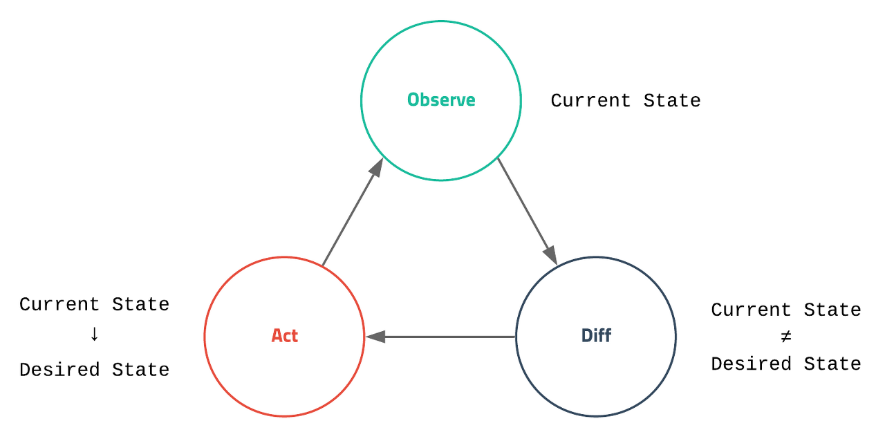

# Kubernetes Concept

## Kubernetes Concept

This is a platform for change current state to desired state.
> *Desired State → Kubernetes → Current State ≠ Desired State → Current State ⇒ Desired State*

\
<small>출처 : [https://ooeunz.tistory.com/118](https://ooeunz.tistory.com/118)</small>
